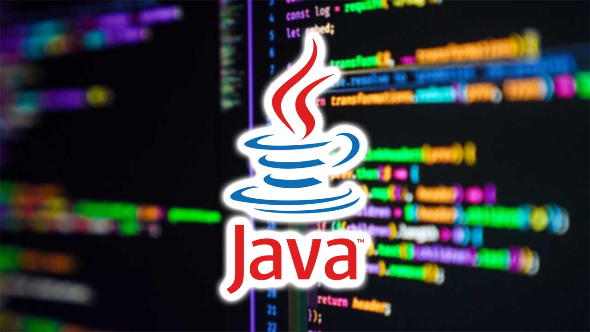

# :school_satchel: Programación - 1º DAW/DAM _(curso 25-26)_

> Curso auxiliar para el alumnado del módulo de **_Programación_** :man_technologist:

## :books: Unidades
1.  [Introducción a la programación y al lenguaje _Java_](https://github.com/pbendom3/prog-1cfgs-2526/blob/main/ups/UP1/up1.md) `1ºT - 28h`
2.  [Programación básica: estructuras de control](https://github.com/pbendom3/prog-1cfgs-2526/blob/main/ups/UP2/up2.md) `1ºT - 24h`
3.  [Estructuras de datos estáticas](https://github.com/pbendom3/prog-1cfgs-2526/blob/main/ups/UP3/up3.md) `1ºT - 28h`
4.  [Programación modular](https://github.com/pbendom3/prog-1cfgs-2526/blob/main/ups/UP4/up4.md) `1ºT - 28h + 12h proyecto`
5.  [Introducción a la _Programación Orientada a Objetos (POO_)](https://github.com/pbendom3/prog-1cfgs-2526/blob/main/ups/UP5/up5.md) `2ºT - 28h`
6.  [Uso avanzado de clases y objetos](https://github.com/pbendom3/prog-1cfgs-2526/blob/main/ups/UP6/up6.md) `2ºT - 28h`
7.  [Estructuras dinámicas de datos y programación funcional](https://github.com/pbendom3/prog-1cfgs-2526/blob/main/ups/UP7/up7.md) `2ºT - 34h`
8.  [Programación gráfica y acceso a datos](https://github.com/pbendom3/prog-1cfgs-2526/blob/main/ups/UP8/up8.md) `3ºT - 56h` **-- Periodo de Formación en Empresa** :construction_worker:

---
> [!TIP]
> **:construction: :bookmark_tabs: SIMULACROS DE EXÁMENES DE RECUPERACIÓN**
>

> 
ORDINARIA

>
>  &nbsp;&nbsp;&nbsp;&nbsp;&nbsp;:computer: <a href="TU_ENLACE_AQUI">Práctico</a> 
>

>

> 
EXTRAORDINARIA

>
>  &nbsp;&nbsp;&nbsp;&nbsp;&nbsp;:page_facing_up: <a href="TU_ENLACE_AQUI">Teórico-práctico (escrito)</a>
>  &nbsp;&nbsp;&nbsp;&nbsp;&nbsp;:computer: <a href="TU_ENLACE_AQUI">Práctico</a> 
>

---

> [!NOTE]
> :bookmark_tabs: [EXÁMENES DE RECUPERACIÓN](https://github.com/pbendom3/prog-1cfgs-2526/blob/main/ups/RECUS/recus.md)
