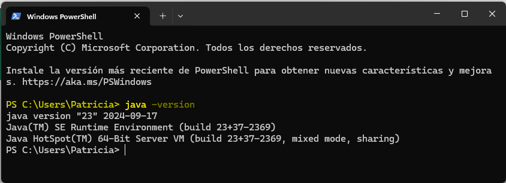

## :a:ctividad. Compilar y ejecutar un programa Java desde la consola

Vamos a compilar y ejecutar nuestro primer programa en lenguaje _Java_. Para ello,

1. Ve a la consola de _Windows_ y ejecuta el comando 

       > java -version

&nbsp;&nbsp;&nbsp;&nbsp;&nbsp;&nbsp;a) Si obtienes un error de comando desconocido, seguramente sea porque no tienes instalado el paquete _JDK - Java SE Development Kit_ en tu ordenador. Dirígete a [Java Downloads | Oracle](https://www.oracle.com/java/technologies/downloads/?er=221886#java26) e instala el que necesites en función de tu sistema operativo. 

&nbsp;&nbsp;&nbsp;&nbsp;&nbsp;&nbsp;:bangbang: Recuerda **reiniciar tu ordenador antes de volver a ejecutar el comando** desde la consola para que los cambios se apliquen correctamente tras la instalación.

&nbsp;&nbsp;&nbsp;&nbsp;&nbsp;&nbsp;b) Si ya tenéis _JDK_ instalado, os debe aparecer un mensaje con la versión y alguna info más:

2. Recupera el archivo `HolaMundo.java` de la práctica anterior.

3. Vuelve a la consola y ejecuta el comando   

       > javac HolaMundo.java 

&nbsp;&nbsp;&nbsp;&nbsp;&nbsp;&nbsp;:warning: ten en cuenta que si el archivo se encuentra en otra ruta debes indicarlo delante del nombre. Por ejemplo:

&nbsp;&nbsp;&nbsp;&nbsp;&nbsp;&nbsp;equivale a: 

&nbsp;&nbsp;&nbsp;&nbsp;&nbsp;&nbsp;Si prefieres usar el comando `cd` para posicionarte en la carpeta antes de lanzar el comando `javac` eres libre de hacerlo (como más fácil te sea).

Lanzar este comando **compilará** nuestra clase _Java_ y se generará un archivo `HolaMundo.class` en la misma carpeta que contuviera al archivo `HolaMundo.java`. Lo que guarda este segundo archivo son los _bytecodes_ que representan al lenguaje escrito a bajo nivel (incomprensible por el ser humano). **Compruébalo**.

4. Vuelve a la consola y ejecuta el comando

       > java HolaMundo.java

&nbsp;&nbsp;&nbsp;&nbsp;&nbsp;&nbsp;Lo que aparece en la pantalla es el resultado de ejecutar el programa del script, que básicamente consiste en mostrar por pantalla el texto _"Hola Mundo!"_. ¡Acabas de ejecutar tu primer programa en _Java_! :v:

---

### :outbox_tray: Entrega

Recopila en un documento de texto todos los pasos realizados anteriormente, pásalo a PDF y súbelo a la entrega de AULES disponible.