## :a:ctividad. Mi primer proyecto de desarrollo. Crear y ejecutar un programa simple en _Java_ con _IntelliJ IDEA_

Vamos a partir del proyecto inicial que nos crea _IntelliJ_ visto en el práctica anterior para traducir al lenguaje _Java_ uno de los ejercicios ya realizados en clase. 

### Programa para sumar dos números leídos por teclado y escribir el resultado.

Para hacerlo un poco más complicado, vamos a añadir:

- Que el programa nos pregunte el **_nombre_**.

- Que el programa nos pregunte el **_curso_** y nos dé la bienvenida a la programación. 

 
&nbsp;&nbsp;&nbsp;Ejemplo de funcionamiento :eyes::

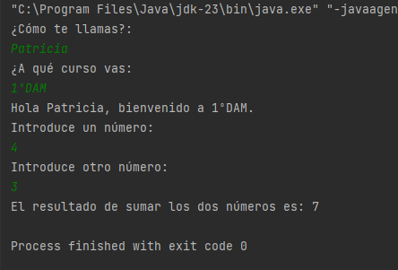

**Vale... ¿Pero cómo se hace :interrobang: Vamos a ello.**

---

En _Java_ hay dos clases que siempre -o casi siempre- debemos usar, que son las que sirven para mostrar o pedir cosas al usuario por la pantalla. 

En la práctica anterior ya vimos que la forma de mostrar algo por pantalla es usar la clase `System.out` junto al método que imprime por pantalla `println`.

La siguiente línea haría que el programa muestre por pantalla `¿Cómo te llamas?`:

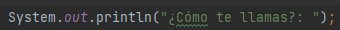

Ahora bien... Para poder contestar a la pregunta y escribir con el teclado, necesitamos llamar a la clase inversa. Es decir, a `System.in`. Para poder usarla, siempre deberemos crear una instancia de la clase _Scanner_ `System.in` en nuestros programas de la siguiente manera:

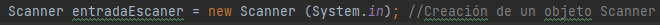

&nbsp;&nbsp;&nbsp;&nbsp;&nbsp;**:pushpin: NOTA**. Observa que al escribir esta línea se ha incorporado a la cabecera del programa la siguiente línea: `import java.util.Scanner;`. **Investiga qué es y coméntalo con tu profe.**

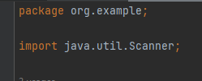

Una vez la tenemos definida, ya podremos empezar a usarla. Por ejemplo, para contestar a la pregunta de cómo nos llamamos, podemos escribir:

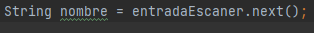

**:collision:¡Uuuy! Pero esta línea tiene más cosas... :dizzy_face: Sí, vamos a explicarla.** Nos hemos definido una variable llamada `nombre` que es de tipo _String_, es decir, va a contener texto (dado que nuestro nombre se escribe con letras).

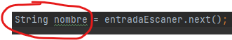

Además, a parte de llamar a la clase creada como `entradaEscaner`, estamos usando el método `.next()`...¿Y eso qué es? Ve a verlo tú mismo. 

Si escribimos `entradaEscaner` + un punto, vemos que _IntelliJ_ nos muestra todos los métodos (o funciones) que esa clase contiene y es capaz de realizar:

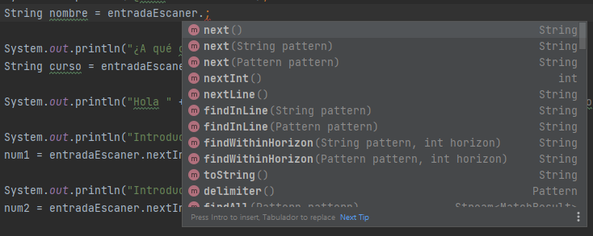

**En el caso de querer introducir un texto ya lo sabemos (con `.next()`), pero, ¿y un número?**

Para introducir números enteros por teclado, deberemos usar el método `.nextInt()` de la siguiente manera:

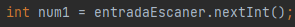

En este caso, hemos definido una variable `num1` como número entero (_int_) y le vamos a asignar el valor que introduzcamos por teclado. 

Si quisiéramos definir una variable con un valor concreto y fijo en el programa, se haría así:

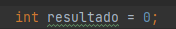

O si queremos que el valor dependa de una operación matemática...

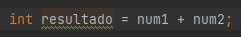

---

**¿Te ves ya capaz de realizar el programa pedido? ¡UN MOMENTO! :hand::arrow_heading_down:** 

Nos falta aclarar una cosa sobre el método `println`, ya que como has podido comprobar, **el programa que queremos hacer debe concatenar texto escrito directamente con el valor que van tomando las variables durante el transcurso del programa**. Por ejemplo:

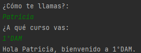

La última línea ha concatenado (unido) "_Hola_" con el nombre que hemos introducido por teclado, "_bienvenido a_" y el curso que también ha sido introducido por el usuario. Para poder hacer esto, **el método `println` permite concatenar diferentes valores usando el símbolo `+`**. Esto es posible no solamente con texto, sino también con números o cualquier tipo de dato imprimible.

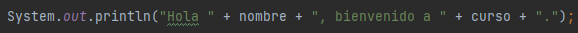

---

### :checkered_flag: En resumen...

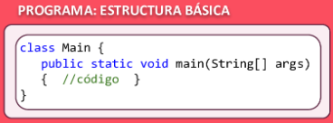

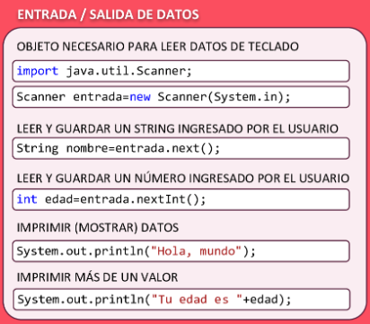

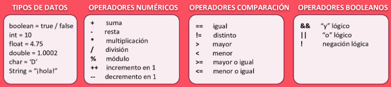

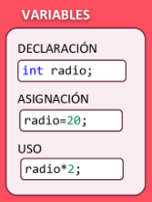

---

### :outbox_tray: Entrega

Modifica el programa inicial para realizar el que se pide en esta práctica. Cuando acabes, sube todos los cambios a _GitHub_ y pega en esta en la tarea de AULES disponible la _URL_ de tu repositorio en remoto.

Además, debes subir a la tarea abierta una -o varias- captura de pantalla donde se vea el funcionamiento del programa que has implementado mientras lo ejecutas. 