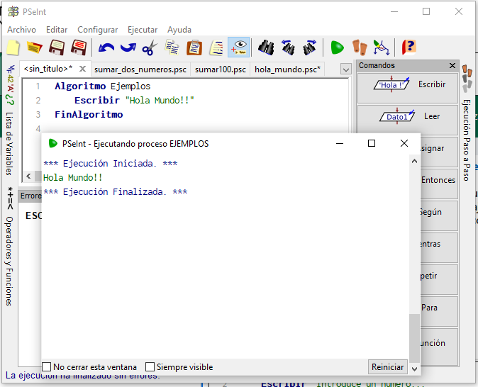
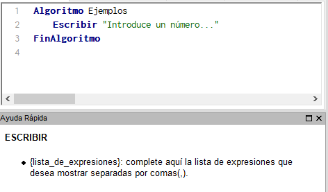
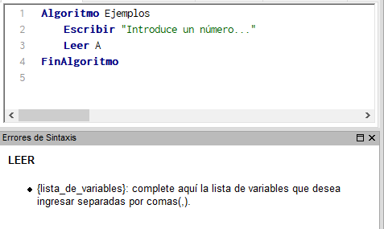
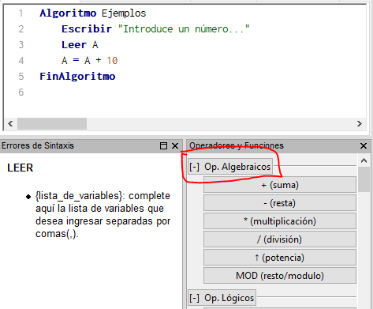
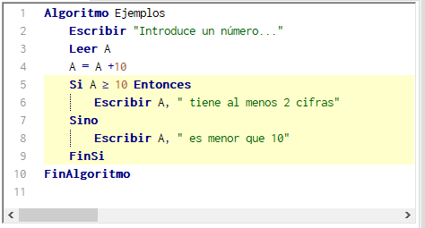
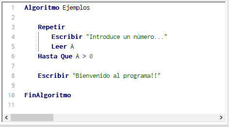
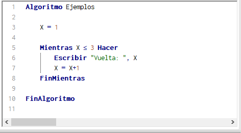
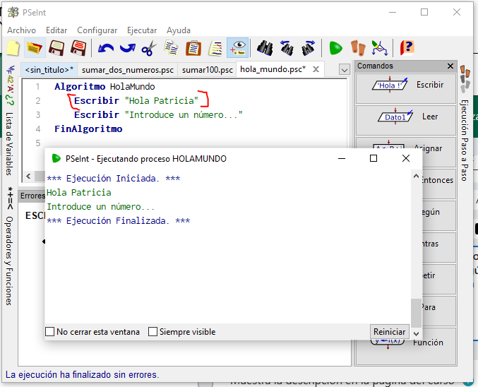
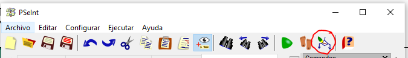
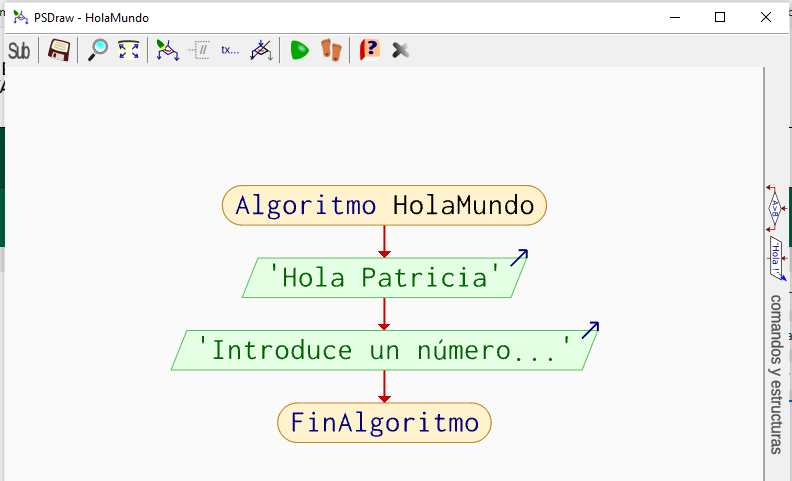

## :a:ctividad. Programando en pseudocódigo con PSeInt

**PSeInt** es una herramienta para asistirnos en nuestros primeros pasos en programación mediante un pseudolenguaje en español (complementado con un editor de diagramas de flujo).

[Acceso a descarga](https://pseint.sourceforge.net/index.php?page=descargasr)

Permite centrar nuestra atención en los conceptos fundamentales de la algoritmia sin preocuparnos por la sintaxis compleja de un lenguaje de programación, y permitiéndonos ejecutar programas escritos en pseudocódigo para comprobar que estos realmente funcionarían.

--- 

### :speech_balloon: Comandos disponibles

- `Escribir`: para mostrar mensajes por pantalla a los usuarios (por ejemplo, para indicarles que deben introducir un número).

- `Leer`: para recoger y guardar el valor de lo que el usuario teclea (por ejemplo, para guardarnos un número).

- Para realizar **operaciones matemáticas**, tenemos disponibles la mayoría de signos tradicionales `+ - * /`.

- `Si - Entonces`: para aplicar condiciones (el rombo de los diagramas en el que solamente puede haber dos respuestas: SI y NO).

- Para **repetir instrucciones** (por ejemplo, para seguir pidiendo al usuario el valor de entrada mientras no sea correcto o ejecutar alguna instrucción varias veces).

    - `Repetir - Hasta que (condicion)` en caso de que necesitemos **controlar la entrada del usuario**, por ejemplo, aceptando solamente números positivos.

    

    - `Mientras (condicion) Hacer - FinMientras` y en el caso en que necesitemos repetir un bloque un número determinado de veces, por ejemplo, 3.

    

---

### :pencil: Tareas

a) Reescribe los ejercicios realizados anteriormente al formato de **PSeInt** y ejecútalos para comprobar que se comportan de forma correcta según lo que se pide en el enunciado de cada problema. Añade una línea al principio de cada programa que te dé la bienvenida con tu nombre.

b) Genera el diagrama de flujo (DFD) a partir del código escrito.

**:warning: Ve recopilando todas las pruebas y diagramas haciendo capturas de pantalla y pegándolas en un documento de texto.**

---

### :outbox_tray: Entrega

Pasa el documento de texto realizado a PDF y súbelo a la de AULES disponible.

