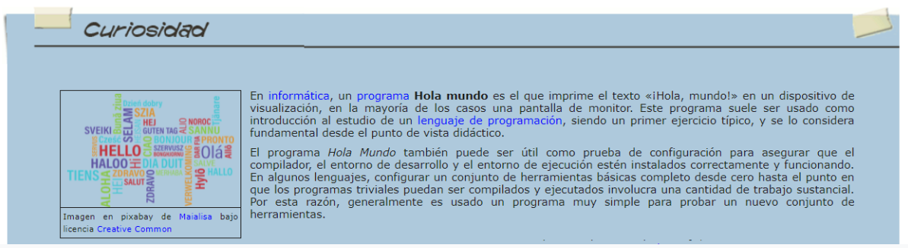
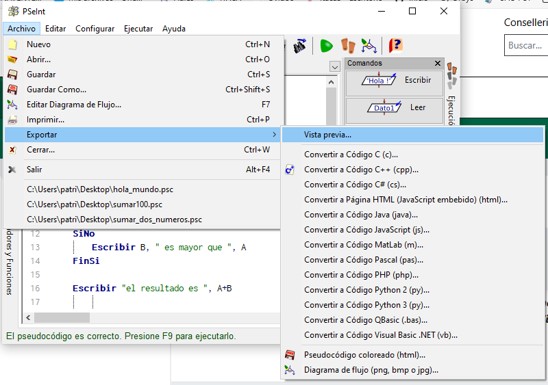
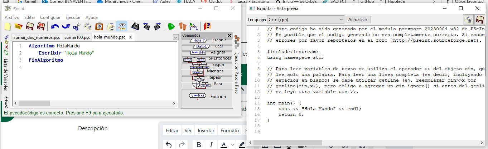
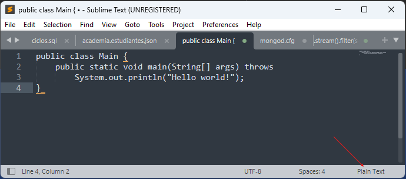
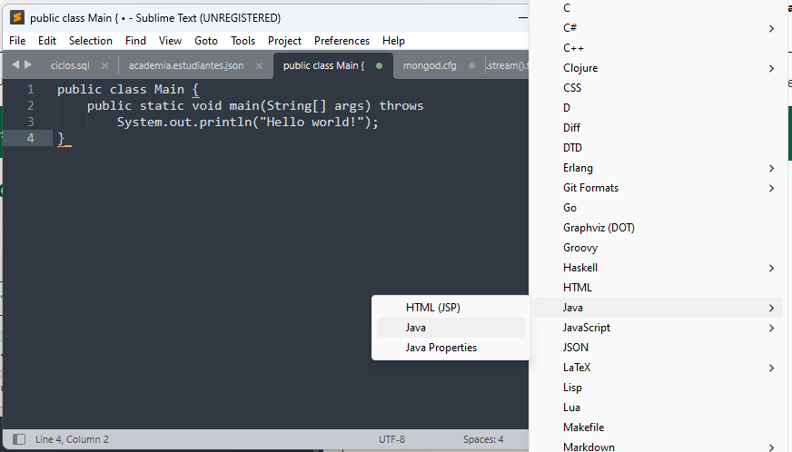
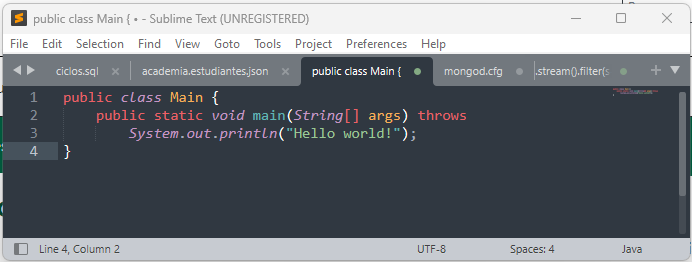
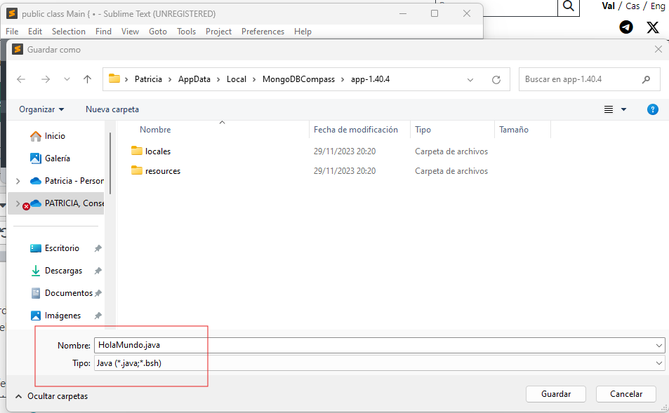

## :triangular_flag_on_post: Práctica 1. Programa “Hola Mundo” (_“Hello World!”_) en varios lenguajes

El programa **_“Hola Mundo”_** (o _“Hello World”_) es el programa por excelencia para iniciarse en un lenguaje de programación. Este consiste en pintar por pantalla la frase _“Hola Mundo”_, de forma que nos sirva para conocer un poco la estructura de cada lenguaje y las sentencias para iniciarnos en cada lenguaje de programación.

---

### :pencil: REALIZACIÓN DE LA PRÁCTICA

1. Descarga la herramienta **SublimeText** (https://www.sublimetext.com/) necesaria para realizar esta práctica. Si prefieres otro editor, instala el que más te guste, pero **no utilices el bloc de notas.**

2. Haz uso de **PSeInt** para saber cómo se codificaría el programa _“Hola Mundo”_ en varios lenguajes de programación. Para ello, dirígete a **_Archivo --> Exportar --> Vista previa_**

&nbsp;&nbsp;&nbsp;&nbsp;&nbsp;&nbsp;**:warning: MODIFICACIÓN** :bangbang: 

&nbsp;&nbsp;&nbsp;&nbsp;&nbsp;&nbsp;En lugar de crear un _"Hola Mundo"_, utilizar el código de alguno de los ejercicios previos realizados con _PSeInt_.

y ve cambiando entre lenguajes:

3. Copia y pega en _SublimeText_ el código concreto para Java, C, C++, PHP y Phyton. 

&nbsp;&nbsp;&nbsp;&nbsp;&nbsp;&nbsp;&nbsp;**:pushpin: NOTA**: fíjate que en _SublimeText_, además de pegar el código, antes de guardar el archivo podéis indicarle qué tipo de lenguaje es.

En el momento lo indicáis, el programa aplica el formato al texto (en este caso para _Java_):

Y además, cuando vayamos a guardarlo, nos pondrá automáticamente la extensión por defecto de cada lenguaje. En el caso de _Java_, el archivo se guardará como ` ejemplo.java `

4. A partir del código recopilado en los diferentes scripts, menciona las diferencias y características principales que se observan a primera vista de cada uno de los lenguajes en cuanto a **estructura y elementos (entrada/salida, variables, constantes, operadores, etc)**.

---

### :outbox_tray: Entrega

Recopila toda la información de los pasos anteriores en un documento de texto y crea una memoria de prácticas. Guárdala en PDF y súbela junto a los scripts guardados desde _SublimeText_ para cada lenguaje.