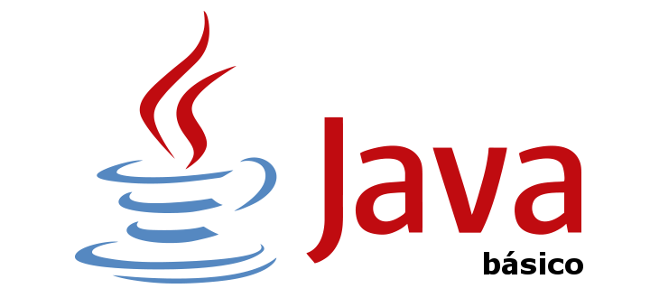
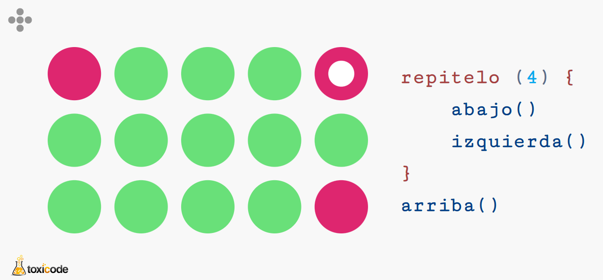
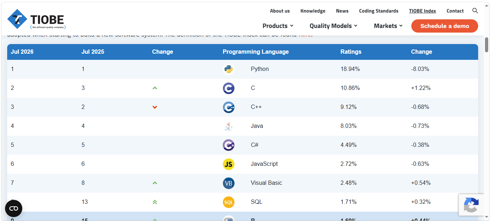

# :blue_book: UP1. Introducción a la programación y al lenguaje _Java_

---

## :book: Estructura de la unidad
[INTRO. ¿Cómo funcionan los programas?](Como_funcionan_los_programas.pdf)

[1. Estructura de un programa informático](https://pbendom3.github.io/prog-1cfgs-2526/ups/UP1/1_1_estructura/index.html)

&nbsp;&nbsp;&nbsp;&nbsp;&nbsp; [:a:ctividad. Ejercicios bocadillo de jamón :bread::meat_on_bone:]()

[2. Pseudocódigos y diagramas de flujo (DFD)](https://pbendom3.github.io/prog-1cfgs-2526/ups/UP1/1_2_pseudo_dfd/index.html)

&nbsp;&nbsp;&nbsp;&nbsp;&nbsp; [:link: _Visual Paradigm Online_ (digitalizar diagramas)](https://online.visual-paradigm.com/app/diagrams/)

&nbsp;&nbsp;&nbsp;&nbsp;&nbsp; [:pencil: Batería de problemas (DFDs y pseudocódigos)](https://github.com/pbendom3/prog-1cfgs-2526/blob/main/ups/UP1/bateria_dfd.md)

&nbsp;&nbsp;&nbsp;&nbsp;&nbsp; [:a:ctividad. Programando en pseudocódigo con _PSeInt_](https://github.com/pbendom3/prog-1cfgs-2526/blob/main/ups/UP1/a_pseudo/a_pseudo.md)	

&nbsp;&nbsp;&nbsp;&nbsp;&nbsp; [:link: _Compute IT_ - Juego de Programación (pseudocódigo)](https://compute-it.toxicode.fr/)

&nbsp;&nbsp;&nbsp;&nbsp;&nbsp;

[3. Lenguajes de programación](https://pbendom3.github.io/prog-1cfgs-2526/ups/UP1/1_3_lenguajes/index.html)

&nbsp;&nbsp;&nbsp;&nbsp;&nbsp; [:link: Popularidad de los lenguajes de programación: _TIOBE Index_](https://www.tiobe.com/tiobe-index/)

&nbsp;&nbsp;&nbsp;&nbsp;&nbsp;

&nbsp;&nbsp;&nbsp;&nbsp;&nbsp; [:triangular_flag_on_post: Práctica 1. Programa “Hola Mundo” (_“Hello World!”_) en varios lenguajes](https://github.com/pbendom3/prog-1cfgs-2526/blob/main/ups/UP1/p1/p1_holamundo.md)

&nbsp;&nbsp;&nbsp;&nbsp;&nbsp; [:a:ctividad. Compilar y ejecutar un programa _Java_ desde la consola](https://github.com/pbendom3/prog-1cfgs-2526/blob/main/ups/UP1/a_compilar/a_compilar.md)

&nbsp;&nbsp;&nbsp;&nbsp;&nbsp; [:triangular_flag_on_post: Práctica 2. Montando nuestro entorno de desarrollo [_IntelliJ IDEA + GitHub + SourceTree_]](https://github.com/pbendom3/prog-1cfgs-2526/blob/main/ups/UP1/p2/p2_entorno.md))

&nbsp;&nbsp;&nbsp;&nbsp;&nbsp; [:a:ctividad. Mi primer proyecto de desarrollo. Crear y ejecutar un programa simple en _Java_ con _IntelliJ IDEA_](https://github.com/pbendom3/prog-1cfgs-2526/blob/main/ups/UP1/a_primer_proyecto/a_primer.md)

[4. Fundamentos del lenguaje _Java_](https://pbendom3.github.io/prog-1cfgs-2526/ups/UP1/1_4_fndamentos_java/index.html) 

&nbsp;&nbsp;&nbsp;&nbsp;&nbsp; [:pushpin: [Chuleta] _Java_ básico :paperclip:](referencia_java.pdf)

&nbsp;&nbsp;&nbsp;&nbsp;&nbsp; [:pencil: Batería de programas sencillos en _Java_ :computer:](https://github.com/pbendom3/prog-1cfgs-2526/blob/main/ups/UP1/bateria_java.md)

[5. Control de errores (Excepciones básicas: _try-catch_)](https://pbendom3.github.io/prog-1cfgs-2526/ups/UP1/1_5_excepciones/index.html)

&nbsp;&nbsp;&nbsp;&nbsp;&nbsp; [:triangular_flag_on_post: Práctica 3. La báscula del feriante de Rabasa :dart::fishing_pole_and_fish::ferris_wheel:](https://github.com/pbendom3/prog-1cfgs-2526/blob/main/ups/UP1/p3/p3_feriante.md)

&nbsp;&nbsp;&nbsp;&nbsp;&nbsp; [:triangular_flag_on_post: Práctica 4. Multiplicaciones de 3 cifras :heavy_multiplication_x::x:](https://github.com/pbendom3/prog-1cfgs-2526/blob/main/ups/UP1/p4/p4_multiplicaciones.md)

--- 

**:pencil::back: Exámenes años anteriores**

- [:open_file_folder: Exámenes UP1 (curso 24-25)](https://github.com/pbendom3/prog-1cfgs/blob/main/ups/UP1/up1.md#ex%C3%A1menes)

---

## :small_red_triangle_down: EXÁMENES
> [:page_facing_up: Teórico-práctico (escrito) - modelo A](EXAMEN_TEÓRICO_UD1_daw.pdf)

> [:page_facing_up: Teórico-práctico (escrito) - modelo B](EXAMEN_TEÓRICO_UD1_DAM.pdf)

> [:computer: Práctico - modelo A - _ELECCIÓN DE NUEVO PAPA: FUMATA BLANCA_](EXAMEN_PRÁCTICO_UD1_modeloA.pdf)

> [:computer: Práctico - modelo B - _ELECCIÓN DE DELEGADO_](EXAMEN_PRÁCTICO_UD1_modeloB.pdf)