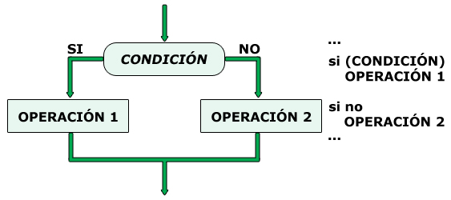
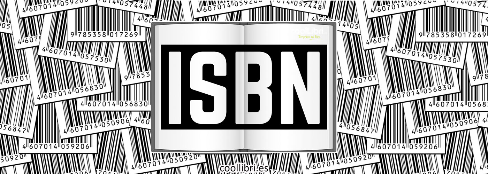

# :blue_book: UP2. Programación básica: estructuras de control

---

## :book: Estructura de la unidad

[1. Trabajando con cadenas de caracteres en _Java_ (textos) :abcd:](https://pbendom3.github.io/prog-1cfgs-2526/ups/UP2/2_1_cadenas/index.html)

&nbsp;&nbsp;&nbsp;&nbsp;&nbsp;[:pencil: Batería de ejercicios con cadenas de caracteres](https://github.com/pbendom3/prog-1cfgs-2526/blob/main/ups/UP2/bateria_cadenas.md)

&nbsp;&nbsp;&nbsp;&nbsp;&nbsp;[:triangular_flag_on_post: Práctica 1. Número de la suerte :1234:](https://github.com/pbendom3/prog-1cfgs-2526/blob/main/ups/UP2/p1/p1.md)
     
[2. Control de excepciones (nivel 2)](https://pbendom3.github.io/prog-1cfgs-2526/ups/UP2/2_2_excepciones/index.html)

&nbsp;&nbsp;&nbsp;&nbsp;&nbsp;[:a:ctividad. Uso de nuevas excepciones y método _.hasNextInt()_ para controlar formatos numéricos](https://github.com/pbendom3/prog-1cfgs-2526/blob/main/ups/UP2/actividad_excepciones.md)	

[3. Estructuras de control condicional](https://pbendom3.github.io/prog-1cfgs-2526/ups/UP2/2_3_condicionales/index.html)

&nbsp;&nbsp;&nbsp;&nbsp;&nbsp;[:a:ctividad. Modificar programa de la actividad anterior para controlar el modo de ejecución con un _switch-case_](https://github.com/pbendom3/prog-1cfgs-2526/blob/main/ups/UP2/actividad_switchcase.md)	

&nbsp;&nbsp;&nbsp;&nbsp;&nbsp;[:triangular_flag_on_post: Práctica 2. Calculadora simple :heavy_multiplication_x::heavy_plus_sign::heavy_minus_sign::heavy_division_sign:](https://github.com/pbendom3/prog-1cfgs-2526/blob/main/ups/UP2/p2/p2_calculadora.md)

&nbsp;&nbsp;&nbsp;&nbsp;&nbsp;[:gift: **BONUS**: el operador ternario **_[:]_** en _Java_](https://pbendom3.github.io/prog-1cfgs-2526/ups/UP2/2_4_ternario/index.html)

[4. Estructuras de control repetitivas/iterativas (bucles :arrows_clockwise:)](https://pbendom3.github.io/prog-1cfgs-2526/ups/UP2/2_5_bucles/index.html)

&nbsp;&nbsp;&nbsp;&nbsp;&nbsp;[:pencil: Batería de ejercicios bucles](https://github.com/pbendom3/prog-1cfgs-2526/blob/main/ups/UP2/bateria_bucles.md)
   
[5. Trazas :pencil2:](https://pbendom3.github.io/prog-1cfgs-2526/ups/UP2/2_7_trazas/index.html)

&nbsp;&nbsp;&nbsp;&nbsp;&nbsp;[:triangular_flag_on_post: Práctica 3. Comprobador de _ISBN_](https://github.com/pbendom3/prog-1cfgs-2526/blob/main/ups/UP2/p3/p3_isbn.md)

   
[:gift: **BONUS**. Conociendo la clase _Random_ (generación de valores aleatorios :twisted_rightwards_arrows:)](https://pbendom3.github.io/prog-1cfgs-2526/ups/UP2/2_6_random/index.html)

&nbsp;&nbsp;&nbsp;&nbsp;&nbsp;[:a:ctividades clase _Random_](https://github.com/pbendom3/prog-1cfgs-2526/blob/main/ups/UP2/actividades_random.md)

---

[**:pencil: Batería de problemas pre-examen :rocket:**](https://github.com/pbendom3/prog-1cfgs-2526/blob/main/ups/UP2/bateria_examen.md)

**:pencil::back: Exámenes años anteriores**

- [:open_file_folder: Exámenes UP2 (curso 24-25)](https://github.com/pbendom3/prog-1cfgs/blob/main/ups/UP2/up2.md#ex%C3%A1menes)

---
   
## :small_red_triangle_down: EXÁMENES
> [:page_facing_up: Teórico-práctico (escrito) - modelo A](EXAMEN_UD2_TEORICO_DAM.pdf)

> [:page_facing_up: Teórico-práctico (escrito) - modelo B](EXAMEN_UD2_TEORICO_DAW.pdf)

> [:computer: Práctico - modelo A](EXAMEN_PRÁCTICO_UD2modeloDAW.pdf)

> [:computer: Práctico - modelo B](EXAMEN_PRÁCTICO_UD2_modelo_DAM.pdf)
