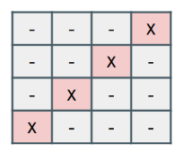
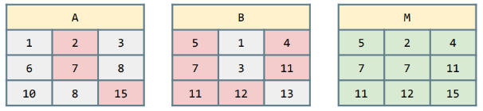

## :pencil: Ejercicios de ejemplo :eyes:

**:arrow_forward: Ejercicio 1**. Crea y carga una matriz cuadrada de _n_ filas por _n_ columnas. 

&nbsp;&nbsp;&nbsp;a) Imprime la diagonal.
&nbsp;&nbsp;&nbsp;b) Piensa una posible solución para imprimir la diagonal de forma invertida (la matriz debe ser la misma). Para n=4:

    public void solucion1(){

        int[][] m = new int[3][3];

        for(int i=0;i<m.length;i++)
        {
            for(int j=0;j<m[i].length;j++)
            {
                if(i == j) m[i][j] = 1;
                else m[i][j] = 0;
            }
        }

        for (int[] fila : m) {
            for (int columna : fila) {
                if(columna == 1) System.out.print("X ");
                else System.out.print("- ");
            }
            System.out.println();
        }

        System.out.println();

        for(int i=0;i<m.length;i++)
        {
            for(int j=m[i].length-1;j>=0;j--)
            {
                if(m[i][j] == 1) System.out.print("X ");
                else System.out.print("- ");
            }
            System.out.println();
        }

    }

**:arrow_forward: Ejercicio 2**. Crea un programa que dadas dos matrices _A_ y _B_, las compare elemento a elemento y muestre otra matriz _M_. Dicha matriz debe tener el `valor máximo` en cada una de las posiciones.

    public void solucion2(){

        int a[][] = new int[3][3];
        int b[][] =  new int[3][3];

        Random aleatorio = new Random();

        for (int i = 0; i < a.length; i++) {
            for (int j = 0; j < a[i].length; j++) {

                a[i][j] = aleatorio.nextInt(9)+1;
                b[i][j] = aleatorio.nextInt(9)+1;

            }

        }

        System.out.println("Matriz A: ");
        for (int[] fila : a){
             System.out.println(Arrays.toString(fila));
        }

        System.out.println("Matriz B: ");
        for (int[] fila : b){
            System.out.println(Arrays.toString(fila));
        }
        
        int m[][] = new int[3][3];

        for (int i = 0; i < a.length; i++) {
            for (int j = 0; j < a[i].length; j++) {
                
                if (a[i][j]>b[i][j]){
                    m[i][j]=a[i][j];
                } else if (a[i][j]<b[i][j]) {
                    m[i][j]=b[i][j];
                }else{
                    m[i][j]=0;
                }

                
            }
            
        }

        System.out.println("Matriz M: ");
        for (int[] fila : m){
            System.out.println(Arrays.toString(fila));
        }

    }