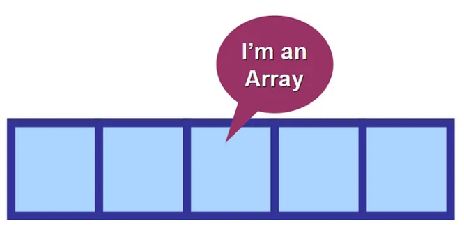
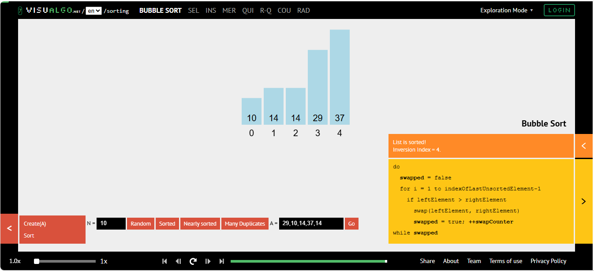
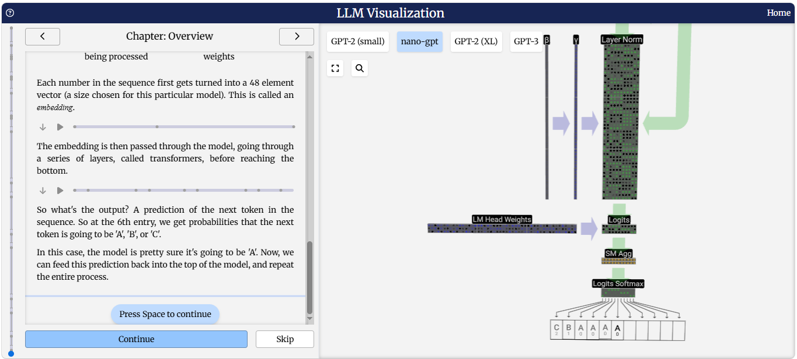

# :blue_book: UP3. Estructuras de datos estáticas

## :book: Estructura de la unidad

[1. Estructura de los vectores (_arrays_)](https://pbendom3.github.io/prog-1cfgs-2526/ups/UP3/3_1_arrays/index.html)

&nbsp;&nbsp;&nbsp;&nbsp;&nbsp;[:pencil: Batería de ejercicios sobre _arrays_ :black_square_button::black_square_button::black_square_button::black_square_button:](https://pbendom3.github.io/prog-1cfgs-2526/ups/UP3/3_1_arrays/batera_de_ejercicios_sobre_arrays.html)

&nbsp;&nbsp;&nbsp;&nbsp;&nbsp;&nbsp;&nbsp;&nbsp;&nbsp;&nbsp;[:link: [Ayuda] Online _Java_ compiler, visual debugger and _AI_ tutor :robot::thought_balloon:](https://pythontutor.com/java.html#mode=edit)

&nbsp;&nbsp;&nbsp;&nbsp;&nbsp;[:triangular_flag_on_post: Práctica 1. Batalla de samuráis ⚔️:crossed_flags:](2_Práctica1_Batalla_de_samuráis.pdf)

&nbsp;&nbsp;&nbsp;&nbsp;&nbsp;[:arrow_upper_right: Práctica ampliación. _Streamer Stats Challenge_ :movie_camera::man_technologist:](2_Práctica1_Batalla_de_samuráis.pdf)
    
[:eight_spoked_asterisk: Ampliación. Método **_.split()_** y uso de **_.asList()_**](https://pbendom3.github.io/prog-1cfgs-2526/ups/UP3/3_2_split_aslist/index.html)

&nbsp;&nbsp;&nbsp;&nbsp;&nbsp;[:a:ctividad. La ruleta del casino :slot_machine: (_asList()_ + _return_)](https://github.com/pbendom3/prog-1cfgs-2526/blob/main/ups/UP1/a_primer_proyecto/a_primer.md)
       
[2. Ordenación de arrays :zero::one::two::three::four::five::abc:](https://pbendom3.github.io/prog-1cfgs-2526/ups/UP3/3_3_ordenacion/index.html)

&nbsp;&nbsp;&nbsp;&nbsp;&nbsp;[:link: Visualgo.net (ORDENACIÓN) - _visualising data structures and algorithms through animation_](https://visualgo.net/en/sorting)

&nbsp;&nbsp;&nbsp;&nbsp;&nbsp;[:a:ctividad. Eliminar duplicados de un _array_](https://github.com/pbendom3/prog-1cfgs-2526/blob/main/ups/UP1/a_primer_proyecto/a_primer.md)

[:eight_spoked_asterisk: Ampliación. Eliminar duplicados de un _array_ con el método **_.distinct()_**](https://pbendom3.github.io/prog-1cfgs-2526/ups/UP3/3_2_split_aslist/index.html)

&nbsp;&nbsp;&nbsp;&nbsp;&nbsp;[:triangular_flag_on_post: Práctica 2. Simulación del sorteo de _La Primitiva_ :game_die::clubs:](6_Práctica2_Simulación_del_sorteo_de_la_Primitiva.pdf)

[:gift: **BONUS [pre-matrices]**. Etiquetar (bautizar) bucles anidados](https://pbendom3.github.io/prog-1cfgs-2526/ups/UP3/3_5_etiquetas/index.html)

&nbsp;&nbsp;&nbsp;&nbsp;&nbsp;[:pencil: Batería de ejercicios pre-matrices: bucles anidados :arrows_counterclockwise::arrows_counterclockwise:](https://github.com/pbendom3/prog-1cfgs-2526/blob/main/ups/UP2/bateria_cadenas.md)

[3. Matrices (_arrays_ bidimensionales)](https://pbendom3.github.io/prog-1cfgs-2526/ups/UP3/3_6_matrices/index.html)

&nbsp;&nbsp;&nbsp;&nbsp;&nbsp;[:pencil: Ejercicios de ejemplo :eyes:](https://github.com/pbendom3/prog-1cfgs-2526/blob/main/ups/UP2/bateria_cadenas.md)

&nbsp;&nbsp;&nbsp;&nbsp;&nbsp;[:link: _LLM Visualization_: Cómo funciona _ChatGPT_ (matrices)](https://bbycroft.net/llm)

&nbsp;&nbsp;&nbsp;&nbsp;&nbsp;[:pencil: Batería de ejercicios sobre matrices (nivel 1)](https://github.com/pbendom3/prog-1cfgs-2526/blob/main/ups/UP2/bateria_cadenas.md)

[4. Tratamiento de vectores en matrices](https://pbendom3.github.io/prog-1cfgs-2526/ups/UP3/3_7_vectores_matrices/index.html)

&nbsp;&nbsp;&nbsp;&nbsp;&nbsp;[:a:ctividad. Mensajes en _Space Invaders_ :space_invader:](https://github.com/pbendom3/prog-1cfgs-2526/blob/main/ups/UP1/a_primer_proyecto/a_primer.md)

&nbsp;&nbsp;&nbsp;&nbsp;&nbsp;[:triangular_flag_on_post: Práctica 3. _ZX Spectrum_ :vhs:: pantallas de carga durante los 80 :tv:](6_Práctica2_Simulación_del_sorteo_de_la_Primitiva.pdf)

---

**:pencil: Batería de problemas pre-examen :rocket:**

- [POR QUÉ PIERDO AL PÁDEL (vectores)](PORQUÉPIERDOALPÁDEL.pdf)

- [EN BÚSQUEDA DE LA NOTITA DE AMOR (matrices)](LABÚSQUEDADELANOTITADEAMOR.pdf)

- [Sopa de letras automatizada (matrices)](Práctica3.Sopadeletras.pdf)

[:open_file_folder: Exámenes UP3 (curso 24-25)](https://github.com/pbendom3/prog-1cfgs/blob/main/ups/UP3/up3.md#ex%C3%A1menes)

---

## :small_red_triangle_down: EXÁMENES

> [:page_facing_up: Teórico-práctico (escrito)](EXAMENTEÓRICOUD3DAW.pdf)

> [:computer: Práctico](EXAMENPRÁCTICOUD3.pdf)
