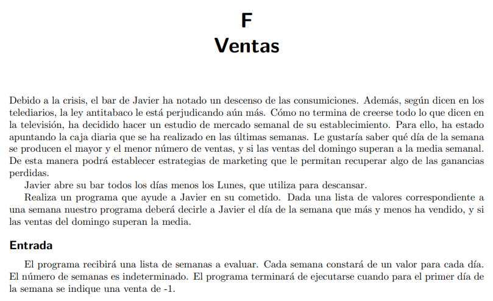
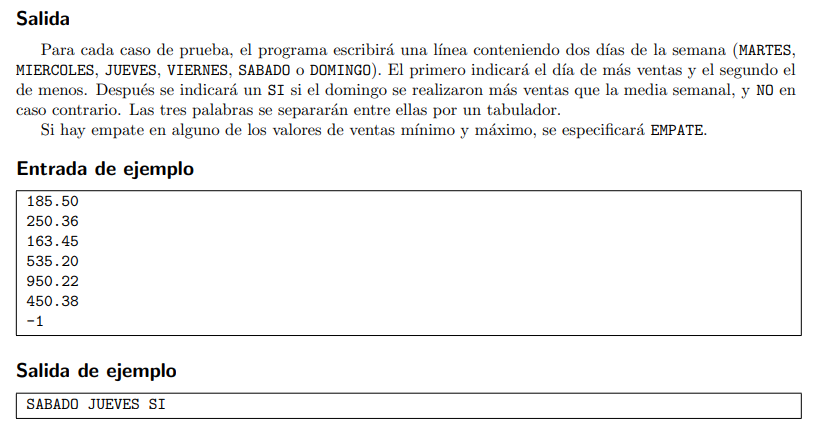

## :pencil: Batería de ejercicios sobre métodos `.()`

**:arrow_forward: Ejercicio 1**. Implementa un método que, dado un número entero _N_, calcule el cubo (_N_3). Realiza un programa principal que pregunte un número _N_ al usuario, llame al método e imprima el resultado que este devuelve.

**:arrow_forward: Ejercicio 2**. Implementa un método para mostrar un menú de _N_ opciones con su número correspondiente. La última opción será para salir. Realiza un programa principal que imprima el menú y pida la opción al usuario, comprobando que esta sea válida.

**:arrow_forward: Ejercicio 3**. Implementa un método (1) para pasar a mayúsculas una cadena. Implementa otro método (2) para contar las vocales de una cadena. 

- Realiza un programa principal que pida una cadena al usuario, se la pase al método (1) e imprima lo que devuelve (una palabra en mayúsculas). 
- Haz que el programa llame también al método (2) con la palabra resultado del método (1) en mayúsculas para que cuente las vocales e imprima la cantidad que este devuelve.

**:arrow_forward: Ejercicio 4**. _ProgramaMe_.

> 🔗 **Enlace al problema:** [¡Acepta el reto! - 105 Ventas](https://aceptaelreto.com)

Resuelve el problema implementando los siguientes métodos:

&nbsp;&nbsp;&nbsp;&nbsp;&nbsp;a) Método que permita al usuario introducir la recaudación de una semana y devuelva los datos en un vector.

&nbsp;&nbsp;&nbsp;&nbsp;&nbsp;b) Método que a partir de la lista creada en el apartado anterior con los importes diarios, devuelva el día de más ventas.

&nbsp;&nbsp;&nbsp;&nbsp;&nbsp;c) Método que a partir de la lista creada en el apartado a) con los importes diarios, devuelva el día con menos ventas.

&nbsp;&nbsp;&nbsp;&nbsp;&nbsp;d) Método que calcule la media semanal.

&nbsp;&nbsp;&nbsp;&nbsp;&nbsp;e) Método que devuelva la recaudación del domingo.

