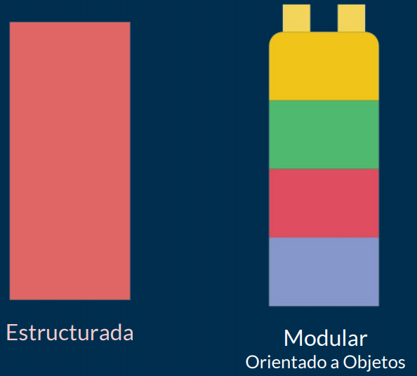

# :blue_book: UP4. Programación modular

## :book: Estructura de la unidad 

[1.  Estructura de un programa Java: funciones y procedimientos](https://pbendom3.github.io/prog-1cfgs-daw/ups/UP4/4_1_metodos/index.html)

[2.  Ámbitos de una variable y sobrecarga de métodos](https://pbendom3.github.io/prog-1cfgs-daw/ups/UP4/4_2_ambitos_sobrecarga/index.html)

     :pushpin: [Ampliación ejercicios vectores y matrices (selección olimpiada)](3_ejercicios.pdf)
  
[3.  Recursividad](https://pbendom3.github.io/prog-1cfgs-daw/ups/UP4/4_3_recursividad/index.html)

:gift: [BONUS. Buenas prácticas: Javadoc](https://pbendom3.github.io/prog-1cfgs-daw/ups/UP4/4_4_javadoc/index.html)

[4.  Introducción a las pruebas unitarias con JUnit](https://pbendom3.github.io/prog-1cfgs-daw/ups/UP4/4_5_junit/index.html)

---

### :school_satchel: Proyecto `individual`

&nbsp;&nbsp;&nbsp;&nbsp;&nbsp;:arrow_right: **Fase 1**. Elección de proyecto :mag_right:

> Entra en el sitio web de **_ProgramaMe: Concurso de Programación para Ciclos Formativos_** y elige alguno de los ejercicios que aparecen en los cuadernillos del histórico de problemas: https://programame.com/archive.php

&nbsp;&nbsp;&nbsp;&nbsp;&nbsp;:arrow_right: **Fase 2**. Desarrollo, pruebas, documentación :file_folder: y entrega del proyecto :outbox_tray:

> Resolver problema con **2 versiones de programa (_.java_)**: 
> - Aplicando programación modular y resolviendo el problema con un programa "bonito".
> - Modo _ProgramaMe_ que pase el juez de _Acepta el Reto_ usando la plantilla.

> Documentar clases y métodos con **_Javadoc_** (generar carpeta con el _HTML_ exportado).

> Realizar pruebas unitarias con **_JUnit_**, explicándolas.

> Generar memoria del proyecto en **_PDF_** (tipo informe de prácticas) y **materiales visuales** necesarios para la exposición oral (_Canva, PowerPoint_, etc.).

&nbsp;&nbsp;&nbsp;&nbsp;&nbsp;:arrow_right: **Fase 3**. Exposición + taller de evaluación entre iguales :speech_balloon:

> :warning: Las personas que no expongan deben entregar un **videotutorial** explicando su solución.

---

**:pencil::back: Exámenes años anteriores**

- [:open_file_folder: Exámenes UP4 (curso 24-25)](https://github.com/pbendom3/prog-1cfgs/blob/main/ups/UP4/up4.md#examen-te%C3%B3rico)

---

## :small_red_triangle_down: EXÁMENES

> [:page_facing_up: Teórico-práctico (escrito)](EXAMENTEÓRICOUD3DAW.pdf)

