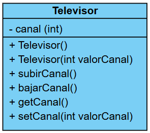
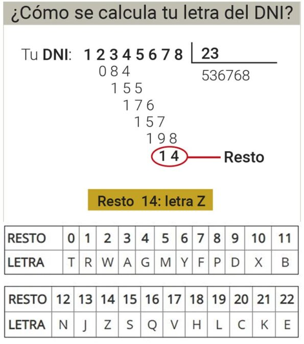
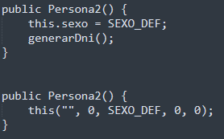

## :pencil: Batería de ejercicios sobre clases y objetos :nut_and_bolt:

**:arrow_forward: Ejercicio 1. CLASE TELEVISOR**

a) Crea una clase de tipo _Televisor_ que cumpla con el siguiente diagrama:

&nbsp;&nbsp;&nbsp;&nbsp;&nbsp;y teniendo en cuenta que el televisor tiene entre 1 y 99 canales.

b) Amplía la clase _Televisor_ con un atributo adicional para el `volumen (int)`. Añade también los `getters` y los `setters`.

c) Cuando creemos una instancia de _Televisor_, esta ya tendrá el `volumen por defecto en el nivel 5`, y el `canal por defecto en el 1`. 

d) Por lo que respecta a la implementación de los métodos que modifican el `canal` y el `volumen`, **no tendremos en cuenta los valores negativos ni tampoco el valor máximo (100)**. Deberemos controlar dichos métodos para que manejen bien esos casos concretos.

e) Al modificar tanto el `volumen` como el `canal` se deben mostrar mensajes indicando el nuevo nivel de volumen o el nuevo número de canal. 

Por ejemplo, en caso de modificar el volumen:

    "Volumen: valorVolumen" 

o en caso de retroceder un canal:

    “Canal: valorCanal”

f) Para comprobar el funcionamiento, desde una clase principal _AplicacionTv_ tenemos que: 
- Crear instancias (objetos) de _Televisor_. 
- Cambia los canales y el volumen para comprobar que todo funciona de forma correcta, y que cada objeto de tipo _Televisor_ tiene su propio estado.

---

**:arrow_forward: Ejercicio 2. CLASE PACIENTE**

Crea una clase llamada _Paciente_ que cumpla las siguientes condiciones:

a) Sus atributos son: `nombre`, `edad`, `DNI`, `sexo (H hombre, M mujer)`, `peso` y `altura`. Si quieres añadir algún atributo puedes hacerlo. **:warning: OJO**: recuerda que no queremos que se acceda directamente a ellos.

b) Todos los atributos menos el `DNI` podrán admitir valores nulos según su tipo (0 números, cadena vacía para _String_, etc.).  `Sexo ` será `"X"`. **Usa una constante para ello.**

c) Método **_generarDNI()_**: genera un número aleatorio de 8 cifras, y a partir de este número, su letra correspondiente. La forma de calcularlo es la siguiente:

- El número del _DNI_ obtenido aleatoriamente se divide entre 23, y se coge el resto de esa división. 
- Cada resto tiene asignada una letra específica según una tabla predeterminada. Usa el siguiente vector como referencia para el orden:

        letras[] = {'T', 'R', 'W', 'A', 'G', 'M', 'Y',
                'F', 'P', 'D', 'X', 'B', 'N', 'J', 'Z',
                'S', 'Q', 'V', 'H', 'L', 'C', 'K', 'E'};

**:warning: Este método será invocado cuando se construya el objeto. No debe ser visible al exterior, ya que se trata de un cálculo interno cada vez que se instancia un objeto desde otra clase.**

d) Se implantarán varios constructores:
- Un constructor con todos los atributos como parámetros.
- Un constructor por defecto.

&nbsp;&nbsp;&nbsp;&nbsp;&nbsp;&nbsp;&nbsp;&nbsp;&nbsp;&nbsp;Prueba de estas dos formas...

&nbsp;&nbsp;&nbsp;&nbsp;&nbsp;&nbsp;&nbsp;&nbsp;&nbsp;&nbsp;:question: ¿Funciona igual? ¿Por qué? :confused:

- Un constructor con el `nombre`, `edad` y `sexo`, el resto por defecto.

e) Los métodos que se implementarán son:

- **_calcularIMC()_**: calculará si la persona esta en su peso ideal `IMC = (peso en kg)/(altura^2 en metros)`. Usa el método `Math.pow`
    -  Si esta fórmula devuelve un valor menor que 20, la función devuelve un -1.
    - Si devuelve un número entre 20 y 25 (incluidos), significa que esta por debajo de su peso ideal la función devuelve un 0 y,
    - Si devuelve un valor mayor que 25 significa que tiene sobrepeso, la función devuelve un 1. 

    &nbsp;&nbsp;**:information_desk_person: Usa constantes para devolver estos valores.**

- **_esMayorDeEdad()_**: indica si es mayor de edad, devuelve un _booleano_.

- **_comprobarSexo(char sexo)_**: comprueba que el sexo introducido es correcto. Si no es correcto, será "X". **No será visible al exterior**.

- **_mostrarInfoPaciente()_**: devuelve toda la información del objeto.

- Métodos _get/set_ de cada atributo, excepto del atributo `DNI`. 

f) Ahora, crea una clase ejecutable (_main_) que haga lo siguiente: 

- Pide por teclado el `nombre`, la `edad`, `sexo`, `peso` y `altura`.

- Crea 3 objetos de la clase anterior: 
    - El primer objeto obtendrá las anteriores variables pedidas por teclado.
    - El segundo objeto obtendrá todos los anteriores menos el peso y la altura. 
    - El último por defecto. Para este último, utiliza los métodos _set_ para darle un valor a los atributos después de crearlo.

- Para cada objeto, el programa principal deberá comprobar si está en su `peso ideal`, tiene `sobrepeso` o `por debajo de su peso ideal` con un mensaje.

- Indicar para cada objeto si es mayor de edad.

- Por último, mostrar la información de cada objeto.