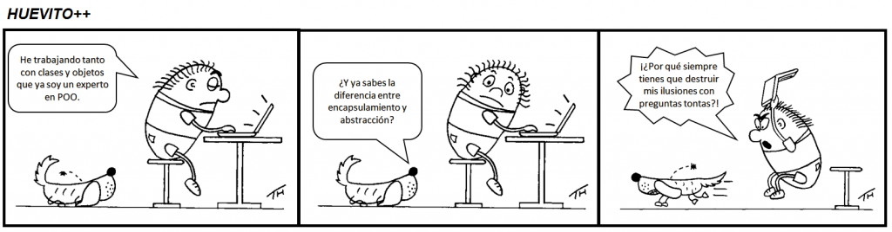
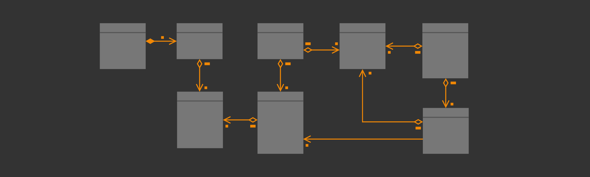
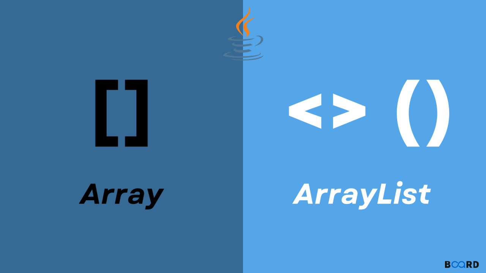

# :blue_book: UP5. Introducción a la _Programación Orientada a Objetos (POO)_

## :book: Estructura de la unidad 

[1.  Introducción a la _POO_](https://pbendom3.github.io/prog-1cfgs-2526/ups/UP5/5_1_introduccion_POO/index.html)

&nbsp;&nbsp;&nbsp;&nbsp;&nbsp;[:pencil: Batería de ejercicios sobre clases y objetos :nut_and_bolt:](https://github.com/pbendom3/prog-1cfgs-2526/blob/main/ups/UP5/bateria_clases.md)

[2.  Método _toString()_ y uso de elementos _static_](https://pbendom3.github.io/prog-1cfgs-2526/ups/UP5/5_2_tostrinc_static/index.html)

&nbsp;&nbsp;&nbsp;&nbsp;&nbsp;[:pencil: Batería de ejercicios :heavy_plus_sign: ampliación sobre clases/objetos y métodos _static_ :unlock:](https://pbendom3.github.io/prog-1cfgs-2526/ups/UP5/5_2_tostrinc_static/ejercicio_de_ampliacin_sobre_clasesobjetos_y_mtodos_static.html)

[3.  Relaciones simples entre clases](https://pbendom3.github.io/prog-1cfgs-2526/ups/UP5/5_3_relaciones/index.html)

&nbsp;&nbsp;&nbsp;&nbsp;&nbsp;**:wrench: Herramientas para digitalizar diagramas _UML_:**

&nbsp;&nbsp;&nbsp;&nbsp;&nbsp;&nbsp;&nbsp;&nbsp;&nbsp;&nbsp;

&nbsp;&nbsp;&nbsp;&nbsp;&nbsp;&nbsp;&nbsp;&nbsp;&nbsp;&nbsp;[:link: Visual Paradigm Online (diagramas _UML_)](https://online.visual-paradigm.com/app/diagrams/)

&nbsp;&nbsp;&nbsp;&nbsp;&nbsp;&nbsp;&nbsp;&nbsp;&nbsp;&nbsp;[:link: Draw.io (diagramas _UML_)](https://app.diagrams.net/)

&nbsp;&nbsp;&nbsp;&nbsp;&nbsp;[:gift: **BONUS**. _ArrayList_ de objetos (con ejercicios) :pencil:](https://pbendom3.github.io/prog-1cfgs-2526/ups/UP5/5_4_arraylists/index.html)

&nbsp;&nbsp;&nbsp;&nbsp;&nbsp;&nbsp;&nbsp;&nbsp;&nbsp;&nbsp;

&nbsp;&nbsp;&nbsp;&nbsp;&nbsp;&nbsp;&nbsp;&nbsp;&nbsp;&nbsp;[:a:ctividad. Incorporar _ArrayList_ a clases _Estudiante_ y _Editorial_](https://pbendom3.github.io/prog-1cfgs-2526/ups/UP5/5_3_relaciones/ejercicio_con_arraylist_para_guardar_varios_elementos.html)

&nbsp;&nbsp;&nbsp;&nbsp;&nbsp;[:pencil: **Partido de Tenis :tennis:**: ejercicio :heavy_plus_sign: ampliación de relaciones (agregación+composición+reflexivas)](https://pbendom3.github.io/prog-1cfgs-2526/ups/UP5/partido_tenis/index.html)

---
   
[:triangular_flag_on_post: Práctica 1. _"El Formiguero"_ 🐜 y _"La Rebelión"_ :fire:](Práctica1.ElFormigueroyLaRebelión.pdf)

&nbsp;&nbsp;&nbsp;&nbsp;&nbsp;[:link: **Tutorial**: Generar documentación en formato _Markdown_](https://docs.github.com/es/get-started/writing-on-github/getting-started-with-writing-and-formatting-on-github/basic-writing-and-formatting-syntax)

[:triangular_flag_on_post: Práctica 2. _PlantUML_ :seedling: Funcionalidades útiles para la _POO_: diagramas de clases automáticos](6_Práctica2_Modelado_PlantUML.pdf)

[:triangular_flag_on_post: Práctica 3. Librerías de ayuda para la implementación de la _POO_: _LOMBOK_ 🌶️
](7_Práctica3_Librerías_LOMBOK.pdf)

---

**:pencil: Batería pre-examen :rocket:**

- [_App_ Bancaria](8_EJERCICIOS_PRE_EXAMEN.pdf)

**:pencil::back: Exámenes años anteriores**

- [:open_file_folder: Exámenes UP5 (curso 24-25)](https://github.com/pbendom3/prog-1cfgs/blob/main/ups/UP5/up5.md#ex%C3%A1menes)

---

## :small_red_triangle_down: EXÁMENES

> [:computer: Práctico - modelo A - _JJOO DE INVIERNO MILÁN - CORTINA D'AMPEZZO 2026_](EXAMEN_PRÁCTICO_JUEGOS.pdf)

> [:computer: Práctico - modelo B - _BENIDORM FEST 2026_](EXAMENPRÁCTICOUD5_BENIDORM.pdf)
