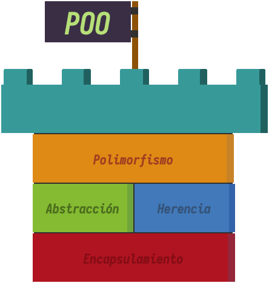
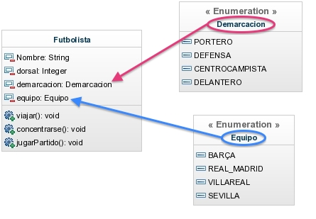

# :blue_book: UP6. Uso avanzado de clases y objetos

&nbsp;&nbsp;&nbsp;&nbsp;&nbsp;&nbsp;&nbsp;&nbsp;&nbsp;&nbsp;&nbsp;&nbsp;&nbsp;&nbsp;&nbsp;

## :book: Estructura de la unidad

[1.  Herencia y polimorfismo (con ejercicios) :family::dancers:](https://pbendom3.github.io/prog-1cfgs-2526/ups/UP6/6_1_herencia/index.html)

[2.  Clases abstractas  (con ejercicios) :ghost:](https://pbendom3.github.io/prog-1cfgs-2526/ups/UP6/6_2_abstractas/index.html)

&nbsp;&nbsp;&nbsp;&nbsp;&nbsp;[:triangular_flag_on_post: Práctica 1. Sistema de pago _E-commerce_ :credit_card:](3_Práctica_1_Sistema_pago_ecommerce.pdf)
     
[3.  Interfaces :handshake::cop: y clases anónimas :bust_in_silhouette: (con ejercicios)](https://pbendom3.github.io/prog-1cfgs-2526/ups/UP6/6_3_interfaces_clases_anonimas/index.html)

&nbsp;&nbsp;&nbsp;&nbsp;&nbsp;[:a:ctividad. Mejora con clases anónimas el proyecto de _Dispositivos Inteligentes_ :iphone:](https://pbendom3.github.io/prog-1cfgs-2526/ups/UP6/6_3_interfaces_clases_anonimas/mejora_con_clases_annimas_el_proyecto_de_dispositivos_inteligentes.html)

[:gift: **BONUS**. Tipos enumerados (_enum_)](https://pbendom3.github.io/prog-1cfgs-2526/ups/UP6/6_4_enums/index.html)

[4.  Excepciones personalizadas (con ejercicios) :bookmark:](https://pbendom3.github.io/prog-1cfgs-2526/ups/UP6/6_5_excepciones/index.html)

&nbsp;&nbsp;&nbsp;&nbsp;&nbsp;[:triangular_flag_on_post: Práctica 2. _Copa del Rey_: Mutxamel FC vs Real Madrid :soccer:](7_Práctica_2_Modernización_MUTXAMEL.pdf)

---

**:pencil::back: Exámenes años anteriores**

- [:open_file_folder: Exámenes UP6 (curso 24-25)](https://github.com/pbendom3/prog-1cfgs/blob/main/ups/UP6/up6.md#ex%C3%A1menes)

---

## :small_red_triangle_down: EXÁMENES

> [:computer: Práctico - modelo A - _DRIFT SPAIN SERIES ASPAR CIRCUIT (VALENCIA)_](EXAMENPRÁCTICOUD6DAW.pdf)

> [:computer: Práctico - modelo B - _REGISTRO DE THERIANS_](EXAMENPRÁCTICOUD6DAM.pdf)