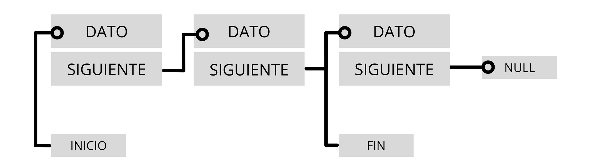

# :blue_book: UP7. Estructuras dinámicas de datos y programación funcional

&nbsp;&nbsp;&nbsp;&nbsp;&nbsp;&nbsp;&nbsp;&nbsp;&nbsp;&nbsp;

## :book: Estructura de la unidad

:bulb: **Chuleta-resumen del tema** - completar durante el trascurso de la unidad... :hourglass_flowing_sand:

[1.  Colecciones - listas (_List_), pilas (_Stack_), colas (_Queue_) y conjuntos (_Set_)](https://pbendom3.github.io/prog-1cfgs-2526/ups/UP7/7_1_colecciones/index.html)

&nbsp;&nbsp;&nbsp;&nbsp;&nbsp;[:a:ctividad. Colas. La lista de la compra :bread::egg::green_apple:](https://pbendom3.github.io/prog-1cfgs-2526/ups/UP6/6_3_interfaces_clases_anonimas/mejora_con_clases_annimas_el_proyecto_de_dispositivos_inteligentes.html)

&nbsp;&nbsp;&nbsp;&nbsp;&nbsp;[:a:ctividad. Conjuntos. Las tareas del funcionario :clipboard::man: + ejercicio _Set_ (_ProgramaMe_)](https://pbendom3.github.io/prog-1cfgs-2526/ups/UP6/6_3_interfaces_clases_anonimas/mejora_con_clases_annimas_el_proyecto_de_dispositivos_inteligentes.html)

[2.  Mapas o diccionarios: interfaz _Map_ (_clave-valor_)](https://pbendom3.github.io/prog-1cfgs-2526/ups/UP7/mapitas/index.html)

&nbsp;&nbsp;&nbsp;&nbsp;&nbsp;[:a:ctividad. Diccionario _Español - Inglés_ :notebook_with_decorative_cover:](https://pbendom3.github.io/prog-1cfgs-2526/ups/UP6/6_3_interfaces_clases_anonimas/mejora_con_clases_annimas_el_proyecto_de_dispositivos_inteligentes.html)

[3.  Elementos útiles :ok_hand: para la manipulación de estructuras (iteradores, comparadores e inmutabilidad)](https://pbendom3.github.io/prog-1cfgs-2526/ups/UP7/7_3_metodos_utiles/index.html)

&nbsp;&nbsp;&nbsp;&nbsp;&nbsp;[:a:ctividad. Aplicación de consola que simula una gestión de reservas de pistas deportivas :basketball::soccer::tennis:](https://pbendom3.github.io/prog-1cfgs-2526/ups/UP6/6_3_interfaces_clases_anonimas/mejora_con_clases_annimas_el_proyecto_de_dispositivos_inteligentes.html)

[🎁 **BONUS**. Manipulación de cadenas de texto con _StringBuilder_](5_BONUS_StringBuilder.pdf)

&nbsp;&nbsp;&nbsp;&nbsp;&nbsp;[:a:ctividad. Carrera de autobuses de _TikTok_ :bus::bus:](https://pbendom3.github.io/prog-1cfgs-2526/ups/UP6/6_3_interfaces_clases_anonimas/mejora_con_clases_annimas_el_proyecto_de_dispositivos_inteligentes.html)

---

[:triangular_flag_on_post: Práctica. Servicio de compra _online_ en MERCADAW :articulated_lorry:](7_Práctica_2_Modernización_MUTXAMEL.pdf)

[:muscle: Problemas de _AceptaElReto_ a resolver durante la unidad](7_Práctica_2_Modernización_MUTXAMEL.pdf)

---

**:pencil::back: Exámenes años anteriores**

- [:open_file_folder: Exámenes UP7 (curso 24-25)](https://github.com/pbendom3/prog-1cfgs/blob/main/ups/UP7/up7.md#ex%C3%A1menes)

---

## :small_red_triangle_down: EXÁMENES

> [:page_facing_up: Teórico-práctico (escrito)](EXAMENTEÓRICOUD3DAW.pdf)

> [:computer: Práctico - _RECOLECTANDO OLIVAS_](EXAMENPRÁCTICOUD3.pdf)

---

[6. Programación funcional. Funciones lambda y operaciones intermedias (_streams_) - con ejercicios :pencil:](https://pbendom3.github.io/prog-1cfgs-2526/ups/UP7/7_3_lambdas/index.html)
