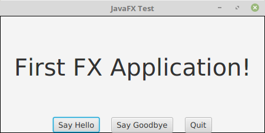

# :blue_book: UP8. Programación gráfica y acceso a datos

## :book: Estructura de la unidad

[1. Introducción a las aplicaciones _JavaFX_ y _Scene Builder_](https://pbendom3.github.io/prog-1cfgs-2526/ups/UP8/8_1_fx/index.html)

&nbsp;&nbsp;&nbsp;&nbsp;&nbsp;[:link: [Descarga] _SceneBuilder_](https://gluonhq.com/products/scene-builder/)

&nbsp;&nbsp;&nbsp;&nbsp;&nbsp;[:triangular_flag_on_post:  Práctica 1. Entrega tutorial: _App_ pruebas en _JavaFX_](https://pbendom3.github.io/prog-1cfgs-2526/ups/UP8/8_1_fx/prctica_1_entrega_tutorial_app_pruebas_en_javafx.html)
   
[2. Acceso a bases de datos relacionales: _MySQL/MariaDB_ :whale2:](https://pbendom3.github.io/prog-1cfgs-2526/ups/UP8/8_2_bbdd_mariadb/index.html)

&nbsp;&nbsp;&nbsp;&nbsp;&nbsp;[:triangular_flag_on_post: Práctica 2. Mi primer CRUD: mostrar y manipular datos desde una _TableView_ de _JavaFX_](https://pbendom3.github.io/prog-1cfgs-2526/ups/UP8/8_2_bbdd_mariadb/prctica_2_mi_primer_crud_mostrar_y_manipular_datos_desde_una_tableview_de_javafx.html)

[🎁 **BONUS**. Herramientas _IA_ para la implementación de modelos de aprendizaje automático en aplicaciones (_Teachable Machine_ + _Tensorflow_)](https://pbendom3.github.io/prog-1cfgs-2526/ups/UP8/tm/index.html)

[3. Ficheros y flujos en _Java_](https://pbendom3.github.io/prog-1cfgs-2526/ups/UP8/8_3_ficheros_flujos/index.html)

&nbsp;&nbsp;&nbsp;&nbsp;&nbsp;[:triangular_flag_on_post: Práctica 3. Manejo de ficheros en _Java_](https://pbendom3.github.io/prog-1cfgs-2526/ups/UP8/8_3_ficheros_flujos/prctica_3_manejo_de_ficheros_en_java.html)
   
[4. Serialización de objetos. Ficheros _JSON_ y consumo de _APIs_](https://pbendom3.github.io/prog-1cfgs-2526/ups/UP8/8_4_serializacion_json/index.html)

&nbsp;&nbsp;&nbsp;&nbsp;&nbsp;[:a:ctividad. Ejercicios sobre serialización :pencil:
]()

&nbsp;&nbsp;&nbsp;&nbsp;&nbsp;[:link: Acceso a _JSON Formatter_](https://jsonformatter.org/)

&nbsp;&nbsp;&nbsp;&nbsp;&nbsp;[:link: [Descarga] _Postman_](https://www.postman.com/downloads/)

&nbsp;&nbsp;&nbsp;&nbsp;&nbsp;[:link: Acceso a _JSON to POJO_ (formato _JSON_ a estructura de clase _Java_)](https://json2csharp.com/code-converters/json-to-pojo)

&nbsp;&nbsp;&nbsp;&nbsp;&nbsp;[:triangular_flag_on_post: Práctica 4. _JSON_ y APIs](https://pbendom3.github.io/prog-1cfgs-2526/ups/UP8/8_4_serializacion_json/bonus_consumiendo_apis_externas_desde_java.html)

[5. Acceso a bases de datos _NoSQL_: _MongoDB_]()

---

### :speech_balloon: Exposición de contenidos de programación aplicados en _FE_ ò _Proyecto Intermodular_

> Exposición + taller de evaluación entre iguales :dancers:

> Entregar **materiales visuales** necesarios para la exposición oral (_Canva, PowerPoint_, etc.).
